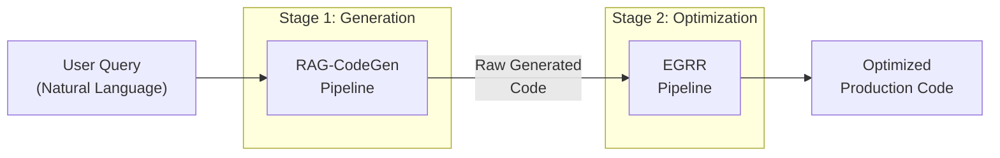

# Research Analysis: Optimised Code Generation via Retrieval-Augmented Generation with Execution-Grounded Iterative Refinement

## 1. Project Understanding — Academic Summary

This project presents a **two-stage hybrid framework** for automated, high-quality source code synthesis. The system sequentially integrates:

1. **RAG-CodeGen Pipeline** — A Retrieval-Augmented Generation (RAG) stage that produces initial code from natural language task descriptions by grounding LLM inference in a semantically retrieved corpus of code patterns.
2. **EGRR Pipeline** — An Execution-Grounded Retrieval Refinement (EGRR) stage that iteratively optimizes the generated code through a closed-loop of execution feedback, evidence-based review, and targeted re-retrieval.

The end-to-end system transforms a user's natural language specification into **production-ready, tested, and optimized code** — eliminating the manual post-generation inspection and refinement cycle that plagues existing LLM-based code generators.

## 2. Pipeline-Level Analysis

### 2.1 RAG-CodeGen Pipeline (Stage 1 — Generation)

**Role:** Context-aware initial code generation

| Step | Component | Function |
|------|-----------|----------|
| 1 | [normalizer.py](file:///d:/data/vs%20code/minor/Optimised-Code-Generation-RAG/legacy/rag-codegen/prompt/normalizer.py) | **Intent normalization** — classifies user task, infers algorithmic constraints (e.g., "prefer mathematical formula", "use sliding window") |
| 2 | [embedder.py](file:///d:/data/vs%20code/minor/Optimised-Code-Generation-RAG/legacy/rag-codegen/ingestion/embedder.py) + [retriever.py](file:///d:/data/vs%20code/minor/Optimised-Code-Generation-RAG/legacy/rag-codegen/vectorstore/retriever.py) | **Semantic retrieval** — embeds user query, retrieves top-k code patterns from FAISS index, filtered by target programming language |
| 3 | [templates.py](file:///d:/data/vs%20code/minor/Optimised-Code-Generation-RAG/legacy/rag-codegen/prompt/templates.py) | **Prompt engineering** — constructs structured prompt with task, language, retrieved context, and inferred constraints |
| 4 | [llm_client.py](file:///d:/data/vs%20code/minor/Optimised-Code-Generation-RAG/legacy/rag-codegen/generation/llm_client.py) | **LLM inference** — calls `meta-llama/Llama-3.1-8B-Instruct` via HuggingFace Inference API |
| 5 | [cleaner.py](file:///d:/data/vs%20code/minor/Optimised-Code-Generation-RAG/legacy/rag-codegen/postprocess/cleaner.py) | **Post-processing** — extracts structured code and explanation from LLM output using tag-based parsing |

**Key Technical Decisions:**
- Uses **sentence-transformers** for embedding and **FAISS** for vector storage
- Employs **intent-aware constraint injection** — not just blind retrieval, but inferred algorithmic guidance
- Output is structured with `<CODE>` / `<EXPLANATION>` tags for reliable parsing


### 2.2 EGRR Pipeline (Stage 2 — Optimization)

**Role:** Iterative, execution-grounded code refinement

The EGRR pipeline implements a **6-phase closed-loop** that runs up to `max_iterations` (default: 5):

```
┌─────────────────────────────────────────────────────────┐
│             EGRR Iterative Refinement Loop               │
│                                                          │
│   Phase 1 ──► Phase 2 ──► Phase 3                       │
│  RETRIEVE     GENERATE     EXECUTE                       │
│     ▲                         │                          │
│     │                         ▼                          │
│   Phase 4 ◄── Phase 6 ◄── Phase 5                       │
│  RE-RETRIEVE   DECISION     REVIEW                       │
│                    │                                     │
│              TERMINATE / CONTINUE                        │
└─────────────────────────────────────────────────────────┘
```

| Phase | Component | Function |
|-------|-----------|----------|
| 1 | [retrieval.py](file:///d:/data/vs%20code/minor/Optimised-Code-Generation-RAG/egrr-pipeline/src/core/phases/retrieval.py) | **Intent-based retrieval** — LLM generates 3-5 search queries from user intent; parallel async vector search across FAISS corpus |
| 2 | [generation.py](file:///d:/data/vs%20code/minor/Optimised-Code-Generation-RAG/egrr-pipeline/src/core/phases/generation.py) | **Code generation / repair / optimization** — three modes: initial generation, error-targeted repair, or scope-validated optimization |
| 3 | [execution.py](file:///d:/data/vs%20code/minor/Optimised-Code-Generation-RAG/egrr-pipeline/src/core/phases/execution.py) | **Sandboxed execution** — runs code in subprocess with timeout; auto-generates pytest test suite; captures coverage via `coverage.py` |
| 4 | (Re-Retrieval) | **Execution-grounded re-retrieval** — extracts error patterns from execution output; generates targeted fix queries; retrieves relevant repair patterns |
| 5 | [review.py](file:///d:/data/vs%20code/minor/Optimised-Code-Generation-RAG/egrr-pipeline/src/core/phases/review.py) | **Evidence-based review** — LLM evaluates code on 4 axes: correctness, security, robustness, performance; cites specific execution evidence |
| 6 | [decision.py](file:///d:/data/vs%20code/minor/Optimised-Code-Generation-RAG/egrr-pipeline/src/core/phases/decision.py) | **Termination logic** — decides CONTINUE (repair or optimize), TERMINATE_SUCCESS, or TERMINATE_MAX_ITERATIONS based on critical issues, optimization score, and iteration count |

**Key Technical Decisions:**
- Uses **Ollama** for local LLM inference (model-agnostic; currently configured for Llama-3.1)
- **Async-first architecture** — all phases use `async/await`; retrieval queries executed in parallel via `asyncio.gather`
- **Dual-mode iteration** — continues iterating not just for bug fixes but also for **optimization** (type safety, readability, performance) even when code is functionally correct
- **Scope validation** — prevents task drift during optimization by verifying function count and name preservation
- **100-example hand-curated corpus** across 5 categories (security, error handling, validation, algorithms, testing patterns)

---

## 3. Integrated System Architecture

### Sequential Flow



### Full Architecture Decomposition

```
User Query (NL)
      │
      ▼
┌─────────────────────────────────────────┐
│        STAGE 1: RAG-CodeGen             │
│  ┌───────────┐  ┌──────────────────┐    │
│  │ Intent    │  │ FAISS Retrieval  │    │
│  │ Normalizer│──│ (Sentence-BERT)  │    │
│  └───────────┘  └──────┬───────────┘    │
│                        │                │
│  ┌─────────────────────▼───────────┐    │
│  │ Prompt Builder + LLM Inference  │    │
│  │ (Llama-3.1-8B via HuggingFace)  │    │
│  └─────────────────────┬───────────┘    │
│                        │                │
│  ┌─────────────────────▼───────────┐    │
│  │ Post-Processing & Cleaning      │    │
│  └─────────────────────┬───────────┘    │
└────────────────────────┼────────────────┘
                         │ Raw Code
                         ▼
┌─────────────────────────────────────────┐
│        STAGE 2: EGRR Pipeline           │
│                                         
│  ┌─────┐  ┌──────┐  ┌─────────┐         │
│  │Retr.│─▶│ Gen. │─▶│Execute │         │
│  └──▲──┘  └──────┘  └────┬────┘        │
│     │                     │             │
│  ┌──┴────┐  ┌──────┐  ┌──▼────┐        │
│  │Re-Ret.│◀─│Decide│◀─│Review │        │
│  └───────┘  └──┬───┘  └───────┘        │
│                │                        │
│         TERMINATE / LOOP                │
└────────────────┼────────────────────────┘
                 │
                 ▼
     Optimized, Tested, Production Code
     + Coverage Report + Test Results
     + Quality Scores + Execution Trace
```

### Technology Stack

| Layer | Stage 1 (RAG-CodeGen) | Stage 2 (EGRR) |
|-------|----------------------|-----------------|
| **LLM** | Llama-3.1-8B (HuggingFace API) | Ollama (local, model-agnostic) |
| **Embeddings** | sentence-transformers | sentence-transformers (`all-MiniLM-L6-v2`) |
| **Vector DB** | FAISS (pickled) | FAISS (indexed binary + metadata) |
| **Execution** | — | subprocess sandbox + pytest + coverage.py |
| **Framework** | CLI (Python script) | FastAPI (async REST API + SSE streaming) |
| **Frontend** | — | Next.js (TypeScript, Axios + SSE) |
| **Validation** | Tag-based parsing | Pydantic v2 models |

---

## 4. Novelty & Research Contributions

### 4.1 Core Novelties (Present in Your System)

| # | Contribution | Description |
|---|-------------|-------------|
| **N1** | **Two-Stage RAG + Optimization Architecture** | Unlike standalone RAG-based generators, this system separates code generation from code optimization into two distinct, specialized pipelines — enabling each stage to focus on its core competency. |
| **N2** | **Execution-Grounded Retrieval Refinement (EGRR)** | The EGRR loop is a novel iterative mechanism where execution feedback (test failures, coverage gaps, runtime errors) directly drives targeted re-retrieval from a specialized code corpus. This is a form of **grounded reasoning** via execution signals. |
| **N3** | **Multi-Axis Evidence-Based Code Review** | The review phase evaluates code across 4 independent axes (correctness, security, robustness, performance) using **execution evidence citations** — not just LLM opinion but grounded in actual test outcomes and coverage data. |
| **N4** | **Dual-Mode Iteration (Repair + Optimization)** | The decision engine distinguishes between two iteration modes: (a) **repair** when critical issues exist, and (b) **optimization** when code is correct but can be improved — enabling convergence toward production-quality rather than mere correctness. |
| **N5** | **Intent-Aware Constraint Injection** | The RAG-CodeGen stage infers algorithmic constraints from user intent (e.g., "prefer formula over loops for sum of N") and injects them into the generation prompt — going beyond simple retrieval-augmentation. |

### 4.2 Additional Novelty Perspectives to Strengthen the Paper

| # | Enhancement | How It Strengthens the Paper |
|---|------------|------------------------------|
| **E1** | **Closed-Loop Feedback as Self-Supervised Learning Signal** | Frame the execution feedback → re-retrieval → re-generation loop as a form of **online self-supervision** where the system learns from its own execution failures without human intervention. This positions your work alongside self-debugging and self-repair literature. |
| **E2** | **Corpus-as-Knowledge-Base** | The 100-example hand-curated corpus across 5 categories (security, error handling, validation, algorithms, testing) acts as a **domain-specific knowledge base**. Unlike general-purpose RAG over arbitrary documents, this is a **curated pattern library** — making retrieval more targeted and less noisy. |
| **E3** | **Execution-Driven Query Reformulation** | The transition from Phase 1 (intent-based retrieval) to Phase 4 (execution-grounded retrieval) represents a novel **query reformulation strategy** where queries evolve based on empirical execution evidence rather than static re-ranking. This can be positioned as a contribution to the RAG reformulation literature. |
| **E4** | **Scope-Preserving Optimization** | The `validate_optimization_scope` function ensures that optimization iterations don't drift from the original task — a novel **intent-preservation mechanism** that addresses a known failure mode in iterative LLM systems. |
| **E5** | **Convergence Criteria with Optimization Threshold** | The decision engine's use of an `optimization_score` threshold (0.95) and explicit `optimization_gaps` for convergence goes beyond simple "pass/fail" termination — offering **multi-dimensional convergence** that considers quality, not just correctness. |
| **E6** | **Ablation Study Potential** | The modular architecture enables rigorous ablation: (a) RAG-only vs. RAG+EGRR, (b) with/without execution-grounded re-retrieval, (c) single-iteration vs. multi-iteration, (d) with/without corpus. This makes the system inherently suitable for controlled experiments. |

---

## 5. Recommended Paper Structure

### 5.1 Abstract (Suggested Key Points)
- Problem: LLM-generated code suffers from functional errors, security vulnerabilities, and suboptimal patterns
- Solution: Two-stage framework combining RAG-based generation with execution-grounded iterative refinement
- Method: RAG-CodeGen for context-aware generation → EGRR for closed-loop optimization via sandboxed execution + evidence-based review
- Results: _(to be filled with experimental metrics)_
- Contribution: First framework to integrate RAG generation with execution-grounded iterative optimization for code synthesis

### 5.2 Introduction
- Motivation: Limitations of existing LLM code generators (hallucination, security flaws, lack of testing)
- Gap: No existing system combines retrieval-augmented generation with iterative execution-based refinement
- Contribution summary (refer to N1-N5)
- Paper structure outline

### 5.3 Related Work
- LLM-based code generation (CodeX, CodeLlama, DeepSeek-Coder)
- RAG for code (RACE, ReACC, DocPrompting)
- Self-debugging and self-repair (Self-Debug, Reflexion, CodeRL)
- Execution-guided generation (CodeT, AlphaCode)
- Position: Your work bridges the gap between RAG-based generation and execution-based self-repair

### 5.4 Methodology
- **System Overview:** Two-stage architecture diagram
- **Stage 1 — RAG-CodeGen:**
  - Intent normalization and constraint inference
  - Semantic retrieval with FAISS + sentence-transformers
  - Context-augmented prompt construction
  - LLM-based code synthesis
- **Stage 2 — EGRR Pipeline:**
  - Phase 1: Intent-based retrieval
  - Phase 2: Context-grounded generation / repair / optimization
  - Phase 3: Sandboxed execution with test generation + coverage
  - Phase 4: Execution-grounded re-retrieval
  - Phase 5: Multi-axis evidence-based review
  - Phase 6: Decision engine with convergence criteria

### 5.5 System Architecture
- Component-level architecture diagram
- Data flow: user query → RAG-CodeGen → EGRR → optimized code
- Technology stack table
- Corpus design and categorization

### 5.6 Novelty & Contributions
- Enumerate and explain N1-N5
- Positioning relative to existing work

### 5.7 Experimental Setup
- **Benchmarks:** HumanEval, MBPP, or custom task suite
- **Metrics:**
  - Pass@k (functional correctness)
  - Test coverage (%)
  - Security vulnerability count
  - Average iterations to convergence
  - Code quality score
  - Execution time
- **Baselines:**
  - Standalone LLM (no RAG, no EGRR)
  - RAG-only (Stage 1 only)
  - LLM + single-pass review (no iteration)
  - Full system (RAG + EGRR)
- **Ablation Studies:**
  - With/without execution-grounded re-retrieval
  - With/without optimization iterations
  - With/without curated corpus

### 5.8 Results & Discussion
- Quantitative comparison tables
- Convergence analysis (iterations needed)
- Case studies showing refinement progression
- Quality improvement across iterations

### 5.9 Conclusion
- Summary of contributions
- Limitations and future work

---

## 6. Identified Strengths of the Project

1. **Clean modular architecture** — each phase is an independent, testable component
2. **Production-grade engineering** — Pydantic validation, async architecture, structured logging, health checks
3. **Full-stack implementation** — backend (FastAPI) + frontend (Next.js) with SSE real-time streaming
4. **Reproducible** — seed-based LLM generation, comprehensive state tracking per iteration
5. **Well-documented domain models** — every entity has field-level descriptions and validation constraints

## 7. Potential Weaknesses to Address in the Paper

1. **Limited corpus size** — 100 examples may constrain retrieval quality; discuss plans for expansion
2. **Single language** — currently Python-only; discuss generalizability
3. **LLM dependency** — results are model-dependent; discuss transferability across LLMs
4. **Sandbox security** — subprocess-based execution without container isolation; acknowledge as a limitation
5. **Intent normalizer** — the RAG-CodeGen normalizer uses rule-based keyword matching (limited coverage); could be replaced with LLM-based intent classification

---

## 8. Suggested Research Title Options

1. *"EGRR-RAG: Execution-Grounded Retrieval Refinement for Optimised Code Generation through Retrieval-Augmented LLMs"*
2. *"A Two-Stage Framework for Automated Code Synthesis: Combining Retrieval-Augmented Generation with Execution-Driven Iterative Optimization"*
3. *"From Generation to Production: An Execution-Grounded RAG Pipeline for High-Quality Code Synthesis"*
4. *"Bridging the Quality Gap in LLM Code Generation: A Hybrid RAG and Execution-Feedback Architecture"*
